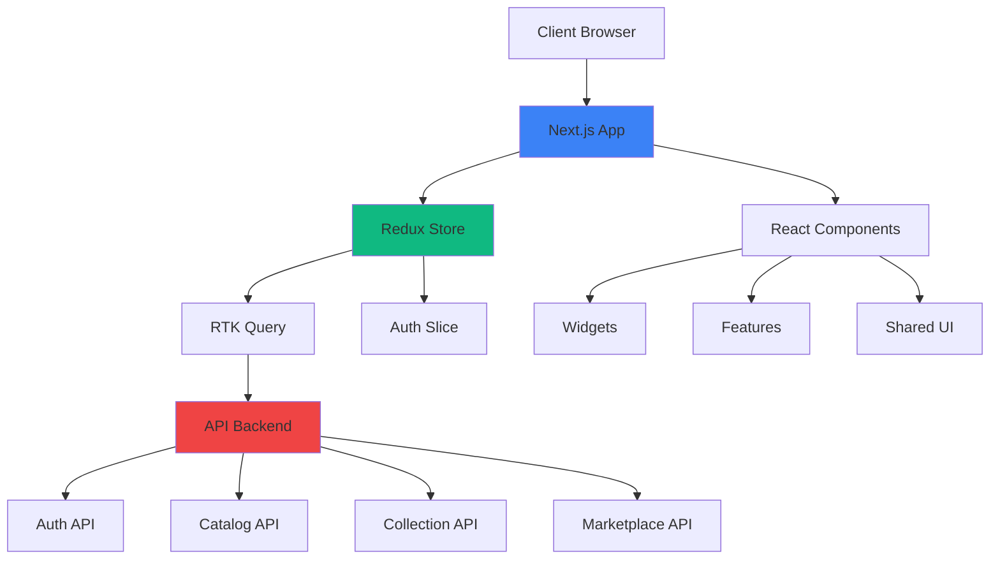
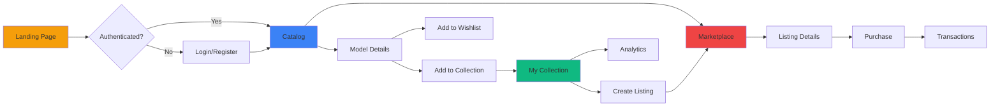

# Hot Wheels Collector Platform

A production-ready web application for Hot Wheels collectors to browse catalogs, manage collections, and trade with other enthusiasts.

## Features

- **Authentication**: JWT-based authentication with refresh token handling
- **Catalog Browsing**: Search, filter, and sort Hot Wheels models
- **Collection Management**: Track your collection with detailed statistics
- **Wishlist**: Keep track of models you want to acquire
- **Marketplace**: Buy and sell with other collectors
- **Transactions**: View purchase and sales history
- **Analytics**: Visualize collection statistics with interactive charts
- **AI Identification** (Optional): Upload images to identify models using AI

## Tech Stack

### Core
- **Framework**: Next.js 16 (App Router)
- **Language**: TypeScript
- **Styling**: TailwindCSS v4 + shadcn/ui

### State Management
- **Redux Toolkit**: Global state management
- **RTK Query**: API caching and data fetching

### Forms & Validation
- **React Hook Form**: Form handling
- **Zod**: Schema validation

### Testing
- **Jest**: Unit testing
- **React Testing Library**: Component testing
- **Playwright**: End-to-end testing

### Other
- **Recharts**: Data visualization
- **Sonner**: Toast notifications

## Architecture

This project follows **Feature-Sliced Design** principles:

```
src/
├── app/                    # Next.js App Router pages
├── shared/                 # Shared utilities and configurations
│   ├── api/               # RTK Query API definitions
│   ├── lib/               # Constants, helpers, validations
│   ├── providers/         # Redux Provider
│   ├── store/             # Redux store configuration
│   ├── types/             # TypeScript type definitions
│   └── ui/                # Reusable UI components
├── entities/              # Business entities (auth, user)
├── features/              # Feature-specific components
│   ├── auth/              # Login/register forms
│   └── catalog/           # Catalog filters
├── widgets/               # Complex UI widgets
│   ├── header.tsx         # Navigation header
│   ├── model-card.tsx     # Model display card
│   └── listing-card.tsx   # Listing display card
```

### Architecture Diagram



### User Flow Diagram



## Environment Variables

Create a \`.env.local\` file in the root directory:

```env
# API Configuration
NEXT_PUBLIC_API_BASE_URL=http://localhost:5000/api/v1
NEXT_PUBLIC_AI_API_BASE_URL=http://localhost:8001/api/v1

# App Configuration
NEXT_PUBLIC_APP_NAME=Hot Wheels Collector
```

## Setup

1. **Install dependencies**:
   ```bash
   npm install
   ```

2. **Set up environment variables**:
   ```bash
   cp .env.example .env.local
   # Edit .env.local with your API endpoints
   ```

3. **Run development server**:
   ```bash
   npm run dev
   ```

4. **Open your browser**:
   Navigate to [http://localhost:3000](http://localhost:3000)

## Testing

### Unit Tests
```bash
npm test
```

### E2E Tests
```bash
npm run test:e2e
```

### Test Coverage
```bash
npm run test:coverage
```

## API Integration

The app expects the following API endpoints:

### Authentication
- POST /auth/register
- POST /auth/login
- POST /auth/refresh
- GET /auth/me
- PUT /auth/me
- POST /auth/logout

### Catalog
- GET /catalog/models
- GET /catalog/models/:id

### Collections
- GET /collections
- POST /collections
- PUT /collections/:id
- DELETE /collections/:id
- GET /collections/stats
- GET /collections/wishlist
- POST /collections/wishlist
- DELETE /collections/wishlist/:id

### Marketplace
- GET /marketplace/listings
- POST /marketplace/listings
- GET /marketplace/listings/:id
- PUT /marketplace/listings/:id
- POST /marketplace/listings/:id/cancel
- POST /marketplace/transactions
- GET /marketplace/transactions/purchases
- GET /marketplace/transactions/sales
- POST /marketplace/reviews

### AI (Optional)
- POST /identify

## Project Structure Details

### Shared Layer
- **api/**: RTK Query API slices with automatic caching
- **lib/**: Constants, validation schemas, and helper functions
- **types/**: TypeScript interfaces for all entities
- **components/**: Reusable components (AuthGuard, etc.)

### Entities Layer
- **auth/**: Authentication state management

### Features Layer
- Feature-specific components with business logic
- Forms and filters with validation

### Widgets Layer
- Complex UI components composed of multiple features
- Header with navigation and user menu
- Model and listing cards

## Key Design Decisions

1. **RTK Query over Axios**: Built-in caching, loading states, and Redux integration
2. **Feature-Sliced Design**: Clear separation of concerns and scalability
3. **Zod Validation**: Type-safe form validation with runtime checking
4. **Token Management**: Access tokens in memory, refresh tokens handled automatically
5. **Optimistic Updates**: Better UX with RTK Query cache invalidation
6. **Component Composition**: Small, focused components for maintainability

## Production Considerations

- ✅ TypeScript for type safety
- ✅ Error boundaries for graceful error handling
- ✅ Loading states for all async operations
- ✅ Responsive design for mobile and desktop
- ✅ Authentication with JWT refresh
- ✅ Protected routes with role-based access
- ✅ Form validation with helpful error messages
- ✅ Toast notifications for user feedback
- ✅ Skeleton loaders for better perceived performance

## License

MIT
```

This README provides comprehensive documentation for the Hot Wheels Collector Platform.
```

```typescript file="" isHidden
